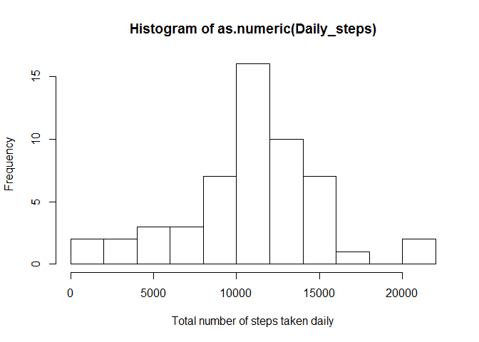
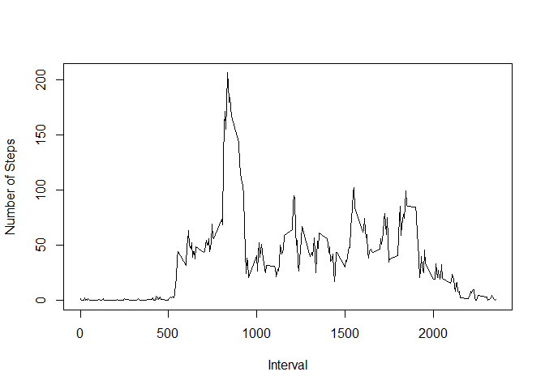
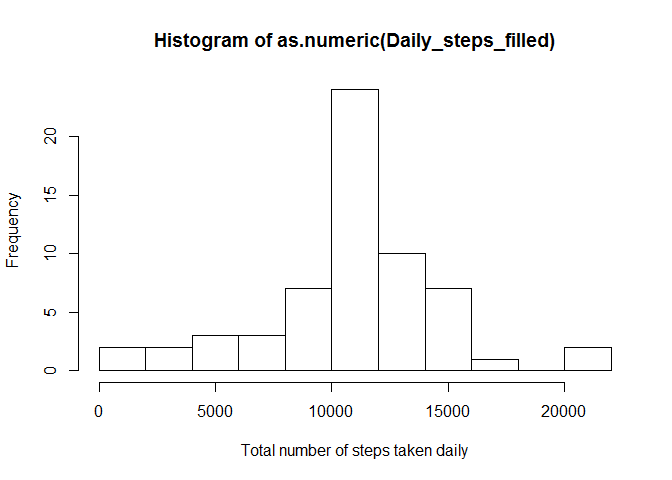
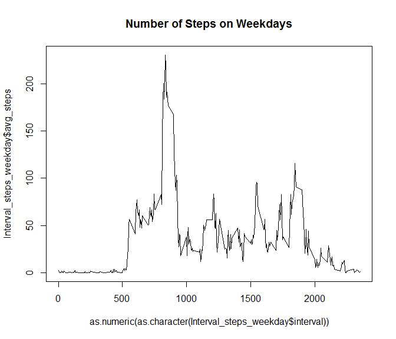
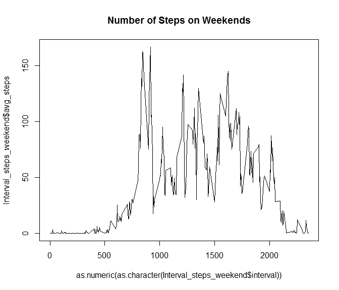

# Reproducible Research: Peer Assessment 1

## Loading and preprocessing the data
First, we load the Activity data from the .csv file and store it in a data frame called "Activity_data" and print the summary of what it contains.


```r
Activity_data <- read.csv("activity.csv")
summary(Activity_data)
```

```
##      steps                date          interval     
##  Min.   :  0.00   2012-10-01:  288   Min.   :   0.0  
##  1st Qu.:  0.00   2012-10-02:  288   1st Qu.: 588.8  
##  Median :  0.00   2012-10-03:  288   Median :1177.5  
##  Mean   : 37.38   2012-10-04:  288   Mean   :1177.5  
##  3rd Qu.: 12.00   2012-10-05:  288   3rd Qu.:1766.2  
##  Max.   :806.00   2012-10-06:  288   Max.   :2355.0  
##  NA's   :2304     (Other)   :15840
```

We can obtain the total number of steps taken daily from the data as follows: 

```r
Steps_vs_date <- split(Activity_data$steps,Activity_data$date)
Daily_steps <- lapply(Steps_vs_date, sum)
```
Similarly, the average number of steps taken in each interval can be obtained as follows:

```r
Activity_data_clean <- na.omit(Activity_data)
Steps_vs_interval <- split(Activity_data_clean$steps,Activity_data_clean$interval)
list <- lapply(Steps_vs_interval, mean)
Interval_steps <- data.frame(interval = names(list), avg_steps = as.numeric(list))
```

## What is mean total number of steps taken per day?
A histogram of the number of steps taken daily is plotted as follows:

```r
hist(as.numeric(Daily_steps), xlab="Total number of steps taken daily", breaks = 10)
```

 

The mean and the median number of steps taken daily is evaluated as:

```r
mean(as.numeric(Daily_steps), na.rm = TRUE)
```

```
## [1] 10766.19
```

```r
median(as.numeric(Daily_steps), na.rm = TRUE)
```

```
## [1] 10765
```
## What is the average daily activity pattern?
A plot of the average daily activity pattern is generated as follows:

```r
plot(as.numeric(as.character(Interval_steps$interval)),Interval_steps$avg_steps, type = "l", xlab ="Interval", ylab="Number of Steps")
```

 

The interval with maximum average daily activity is:

```r
index = which(Interval_steps$avg_steps == max(Interval_steps$avg_steps))
as.numeric(as.character(Interval_steps$interval[index]))
```

```
## [1] 835
```

## Imputing missing values

The total number of rows with "NA" values is compueted as follows:

```r
sum(is.na(Activity_data$steps))
```

```
## [1] 2304
```


```r
Activity_data_filled <- Activity_data
Activity_data_filled$steps[is.na(Activity_data$steps)] <- rep( Interval_steps$avg_step, 8)
Steps_vs_date_filled <- split(Activity_data_filled$steps,Activity_data_filled$date)
Daily_steps_filled <- lapply(Steps_vs_date_filled, sum)
hist(as.numeric(Daily_steps_filled), xlab="Total number of steps taken daily", breaks = 10)
```

 

The mean and the median number of steps taken daily is evaluated as:

```r
mean(as.numeric(Daily_steps_filled))
```

```
## [1] 10766.19
```

```r
median(as.numeric(Daily_steps_filled))
```

```
## [1] 10766.19
```

The mean number of steps remains unchanged as compared to the first part. However the median number of steps increases to become equal to the mean. The effect of imputing missing values is to make the mean and the median of the data equal.

## Are there differences in activity patterns between weekdays and weekends?


```r
weekenddays <- c("Saturday","Sunday")
Activity_data_filled$day <- factor(   weekdays(as.Date(Activity_data_filled$date)) %in% weekenddays , levels = c("FALSE","TRUE"), labels = c("weekday", "weekend"))
a <- Activity_data_filled[Activity_data_filled$day == "weekday",] 
b <- Activity_data_filled[Activity_data_filled$day == "weekend",] 

Steps_vs_interval_weekday <- split(a$steps,a$interval)
list_weekday <- lapply(Steps_vs_interval_weekday, mean)
Interval_steps_weekday <- data.frame(interval = names(list_weekday), avg_steps = as.numeric(list_weekday))

Steps_vs_interval_weekend <- split(b$steps,b$interval)
list_weekend <- lapply(Steps_vs_interval_weekend, mean)
Interval_steps_weekend <- data.frame(interval = names(list_weekend), avg_steps = as.numeric(list_weekend))
par(mfrow=c(2,1))
```

```r
plot(as.numeric(as.character(Interval_steps_weekday$interval)),Interval_steps_weekday$avg_steps, main="Number of Steps on Weekdays", type ="l")
```

 

```r
plot(as.numeric(as.character(Interval_steps_weekend$interval)),Interval_steps_weekend$avg_steps, main="Number of Steps on Weekends", type ="l")
```

 

In general, it is observed that the average number of steps on the weekend are higher than on the weekdays.


